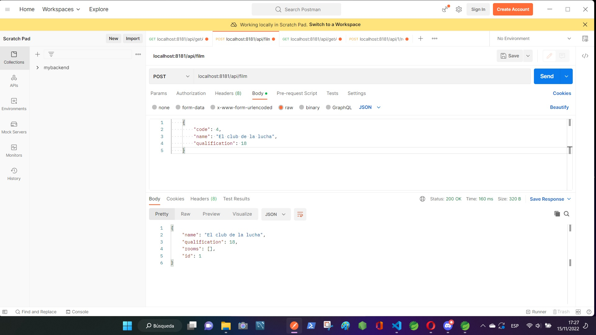
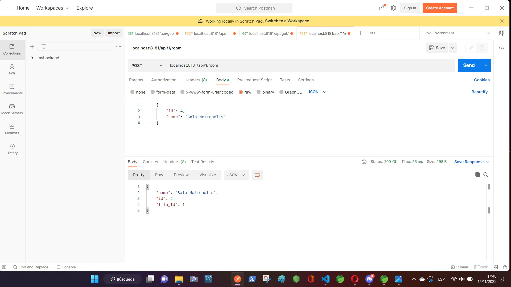
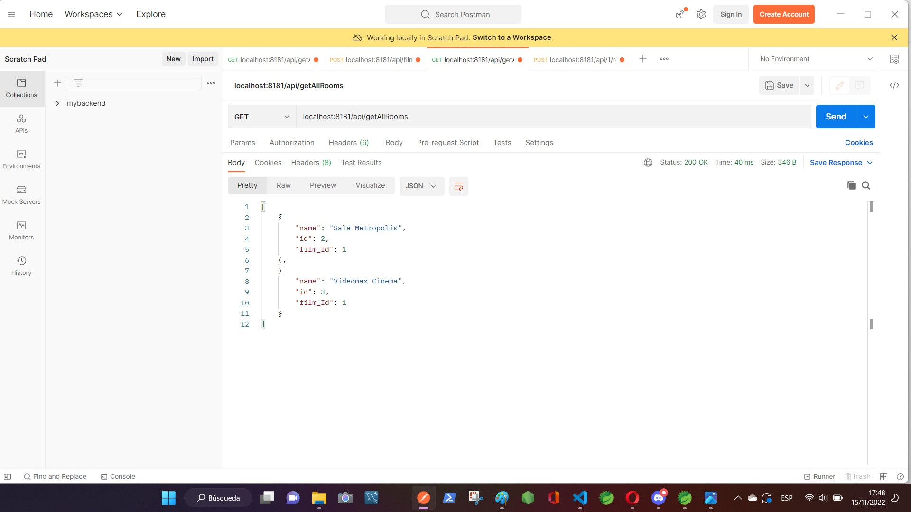
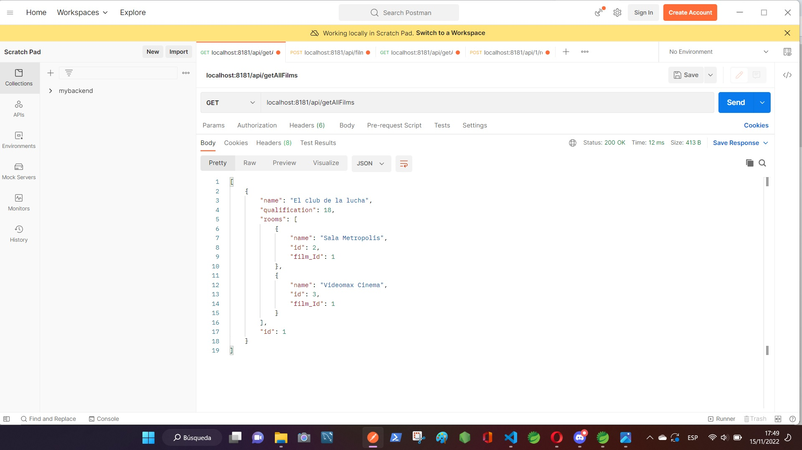

# Spring_REST_API-movie-backend
Spring Project with JPA + H2 (Simple CRUD N:N) + ER with at least Entities.
#
## ENDPOINTS

## GET
server/api/getAllFilms 
server/api/getAllRooms 
server/api/room/{roomId}
## POST
server/api/{film_id}/room
##

