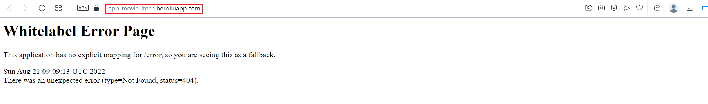
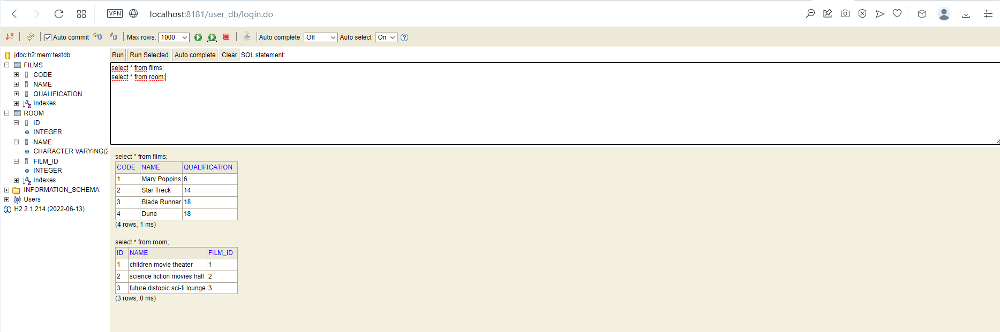
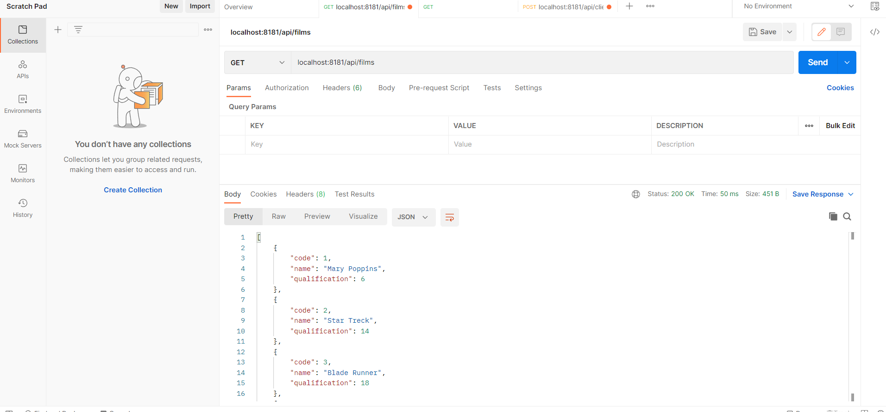

# Spring_REST_API-movie-manager
Spring Project with JPA + H2 (Simple CRUD N:N) + ER with at least Entities.
#
## ENDPOINTS

## GET
server/api/films 
server/api/films/{id} 
server/api/rooms 
server/api/rooms/{id}
## POST
server/api/films 
server/api/rooms
## PUT
server/api/films/{id} 
server/api/rooms/{id}
## DELETE
server/api/films/{id} 
server/api/rooms/{id}
##

